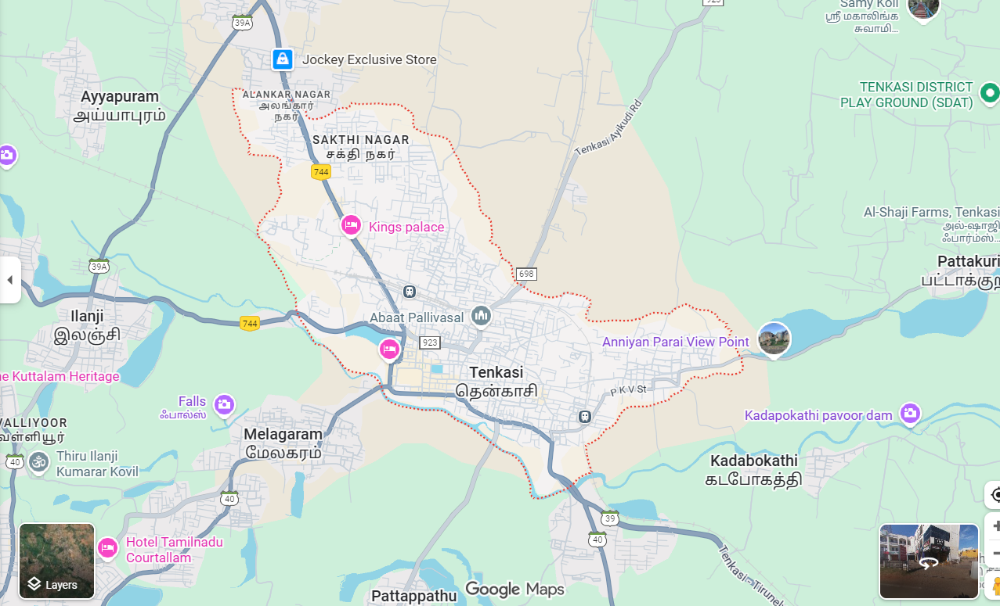

# Ex04 Places Around Me
## Date: 10-12-2025

## AIM
To develop a website to display details about the places around my house.

## DESIGN STEPS

### STEP 1
Create a Django admin interface.

### STEP 2
Download your city map from Google.

### STEP 3
Using ```<map>``` tag name the map.

### STEP 4
Create clickable regions in the image using ```<area>``` tag.

### STEP 5
Write HTML programs for all the regions identified.

### STEP 6
Execute the programs and publish them.

## CODE
```
<!DOCTYPE html>
<html lang="en">
<head>
    <meta charset="UTF-8">
    <meta name="viewport" content="width=device-width, initial-scale=1.0">
    <title>Document</title>
</head>
<body>
    

<map name="image-map">
    <area target="" alt="home town" title="home town" href="s.html" coords="637,328,835,502" shape="rect">
    <area target="" alt="electrical famous" title="electrical famous" href="m.html" coords="1222,471,1070,325" shape="rect">
   <area target="" alt="textiles" title="textiles" href="k.html" coords="462,738,678,838" shape="rect">
</map>
</body>
</html>

<html>
<head>
<title>electrical famous</title>
</head>
<body bgcolor="red">
<h1 align="center">
<font color="red"><b>THENKASI</b></font>
</h1>
<h3 align="center">
<font color="blue"><b>SAKTHINAGAR-electrical famous</b></font>
</h3>
<hr size="3" color="red">
<p align="justify">
<font face="Georgia" size="5">
Sakthi Nagar in Tenkasi is a rapidly developing residential and commercial area,
known for its strategic location near Tenkasi New Bus Stand, 
hospitals, schools, and close to tourist spots like Courtallam Falls, 
it a prime spot for real estate investment with good growth potential,
affordable housing options, and improving infrastructure. 

</font>
</p>
</body>
</html>

<html>
<head>
<title>BIRTHPLACE famous</title>
</head>
<body bgcolor="red">
<h1 align="center">
<font color="red"><b>THENKASI</b></font>
</h1>
<h3 align="center">
<font color="blue"><b>MELAGARAM-BIRTHPLACE famous</b></font>
</h3>
<hr size="3" color="red">
<p align="justify">
<font face="Georgia" size="5">
Melagaram is a significant panchayat town in Tenkasi District,
Tamil Nadu, known for its historical and cultural contributions, 
especially as the birthplace of the renowned Tamil poet and composer Thirigudarasapa Kavirayar (circa 17th century),
who authored the classic poem Thirutrala Kuravanji

</font>
</p>
</body>
</html

<html>
<head>
<title>RURAL famous</title>
</head>
<body bgcolor="red">
<h1 align="center">
<font color="red"><b>THENKASI</b></font>
</h1>
<h3 align="center">
<font color="blue"><b>KADABOKATHI-RURAL famous</b></font>
</h3>
<hr size="3" color="red">
<p align="justify">
<font face="Georgia" size="5">
Kadabokathi (or Kadabokathi BO) is a small locality/village area in the Tenkasi District,
Tamil Nadu, previously part of Tirunelveli District, 
known primarily as a Post Office Branch (BO) serving the local rural population,
with its postal codes linked to nearby towns like Kadayanallur, 
offering essential services in the region that's rich in culture, agriculture,
and temples like the Kutralam Falls area nearby. 
</font>
</p>
</body>
</html>

```

## OUTPUT



## RESULT
The program for implementing image maps using HTML is executed successfully.
